# LAPORAN PRAKTIKUM 2

## PROGRAM AWAL
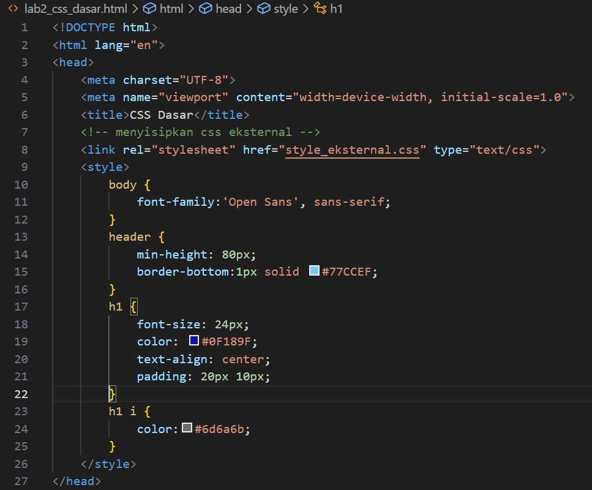
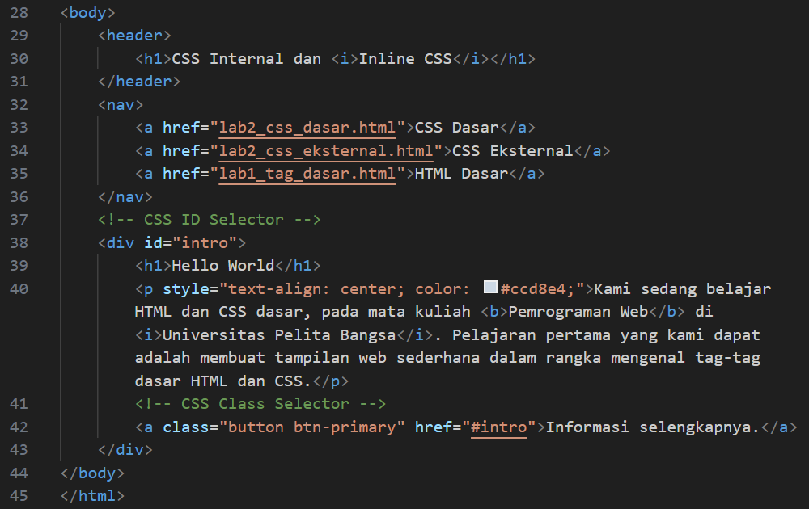
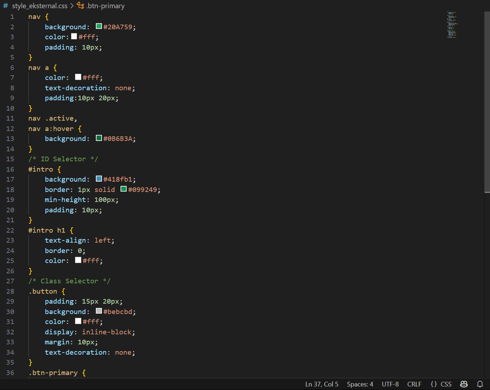
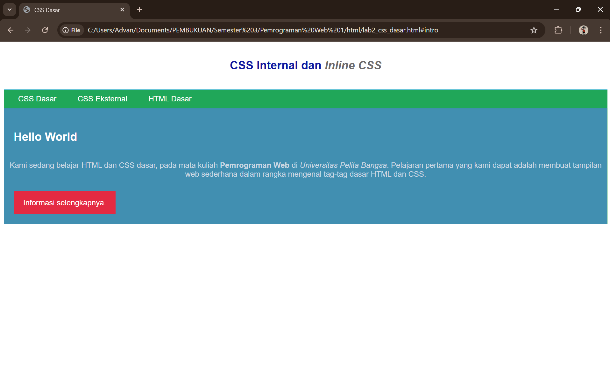

## SOAL DAN JAWABAN

### Soal
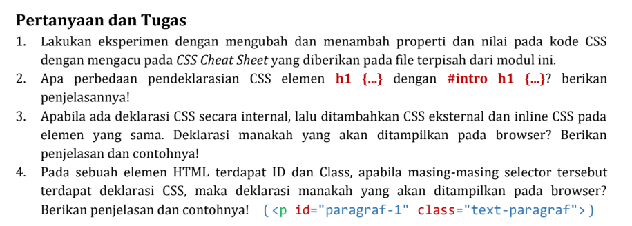

### Jawaban

  1. Eksperimen Mengubah dan Menambah Properti CSS

CSS (Cascading Style Sheets) berfungsi untuk mengatur tampilan halaman web agar lebih menarik dan terstruktur. Dengan CSS, kita dapat mengubah warna teks, ukuran huruf, tata letak, margin, padding, hingga efek transisi. 
Eksperimen dilakukan dengan menambahkan berbagai properti ke elemen HTML. Elemen h1 akan memiliki teks berwarna biru, ukuran besar, rata tengah, huruf kapital semua, serta jarak antar huruf. 
Elemen p akan berwarna hijau, memiliki latar belakang abu-abu, diberi padding 15px, garis tepi abu-abu, dan jarak antarbaris lebih longgar.

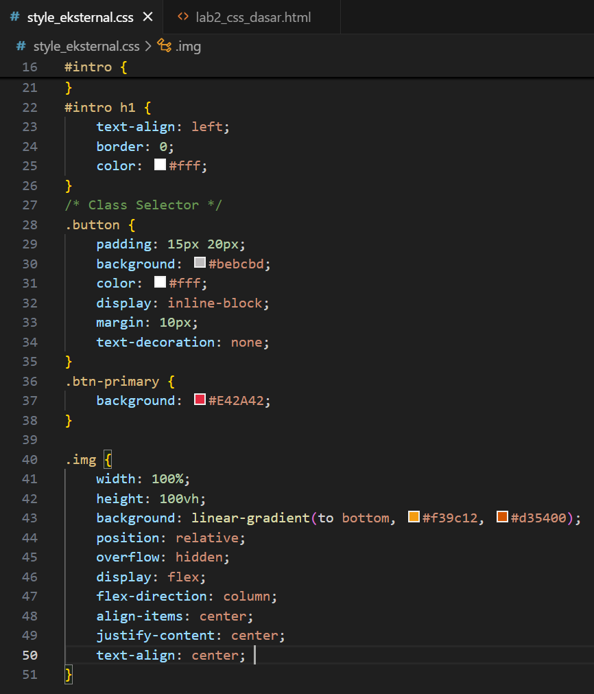
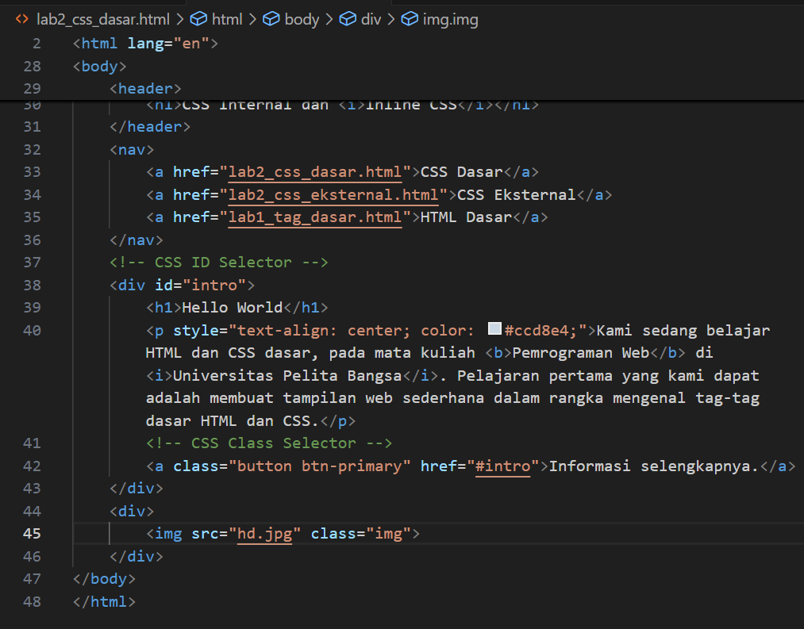

  2. Perbedaan h1 {…} dengan intro h1 {…}

Selector h1 adalah selector elemen yang berlaku untuk semua heading h1 di dalam dokumen HTML. Artinya, setiap kali ada h1 maka styling tersebut akan diterapkan. Sementara itu, intro h1 adalah selector gabungan antara ID dan elemen. Selector ini berarti hanya h1 yang berada di dalam elemen dengan id="intro" yang akan terpengaruh. Dengan kata lain, selector ini lebih spesifik dibanding selector umum h1.

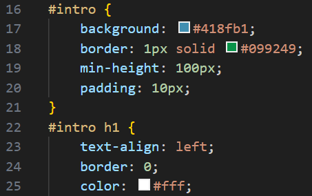

  3. Perbedaan Internal, Eksternal, dan Inline CSS

Dalam sebuah halaman web, CSS dapat dituliskan dengan tiga cara yaitu eksternal, internal, dan inline. Eksternal CSS adalah kode CSS yang disimpan di file terpisah dengan ekstensi .css lalu dipanggil menggunakan tag link di dalam head. Keuntungannya, kode lebih rapi dan bisa dipakai ulang di banyak halaman. Internal CSS adalah kode CSS yang ditulis langsung di dalam tag <style> di bagian <head> dari dokumen HTML. Biasanya digunakan jika gaya hanya berlaku di satu halaman saja. Sementara itu, inline CSS ditulis langsung di dalam atribut style pada elemen HTML, misalnya p style="color:red;". Inline CSS memiliki prioritas tertinggi, artinya jika ada aturan eksternal dan internal sekaligus, inline-lah yang akan ditampilkan. Urutannya adalah: Inline > Internal > Eksternal. Hal ini bisa dilihat pada file lab2_css_dasar.html yang menggunakan ketiganya: eksternal dari style_eksternal.css, internal pada style di head, dan inline pada tag p yang memberi warna abu-abu ke teks. Meskipun warna teks paragraf bisa diatur di internal atau eksternal, warna abu-abu dari inline yang akan menang karena prioritasnya paling tinggi.

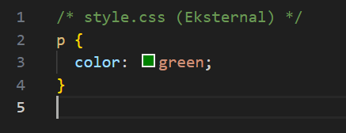

  4. Perbedaan ID dan Class dalam CSS

ID dan class adalah dua cara untuk memberi identitas pada elemen HTML agar bisa diatur dengan CSS. ID bersifat unik, artinya hanya boleh digunakan sekali dalam satu halaman, sementara class bisa digunakan berkali-kali pada banyak elemen. Dalam hal prioritas, CSS yang menggunakan ID lebih kuat dibanding CSS yang menggunakan class. Jika ada elemen yang memiliki ID dan class sekaligus, maka aturan ID akan menang jika terjadi konflik. Misalnya, pada file style_eksternal.css, ID #intro digunakan untuk mengatur area tertentu agar memiliki background biru, sedangkan class .button dan .btn-primary digunakan pada tombol a agar bisa digunakan di banyak tempat. Dengan cara ini, ID digunakan untuk bagian khusus halaman, sedangkan class digunakan untuk gaya yang berulang. Jika ada elemen p dengan id="paragraf-1" sekaligus class="text-paragraf", maka deklarasi dengan ID akan ditampilkan lebih dominan dibanding class, meskipun class masih bisa memberikan gaya tambahan selama tidak bertentangan.

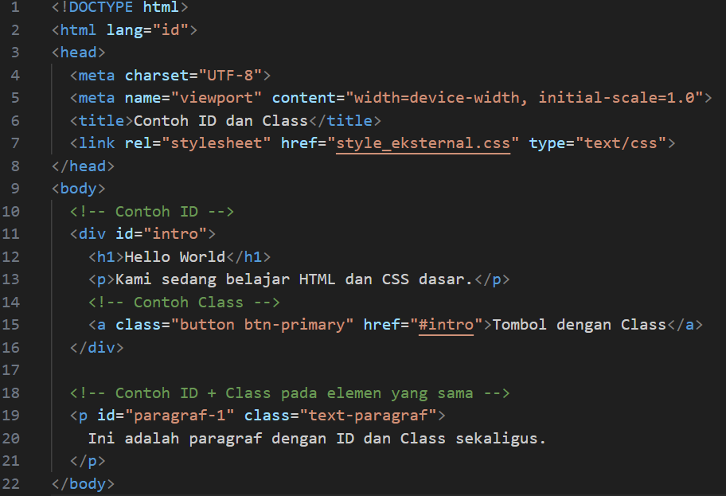
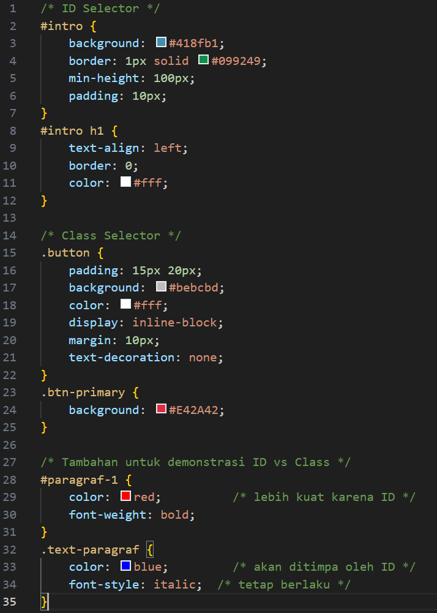

## PROGRAM AKHIR
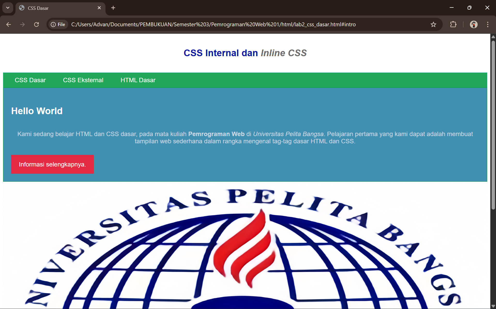

## KESIMPULAN

Dari percobaan menggunakan file lab2_css_dasar.html dan style_eksternal.css, dapat dipahami bahwa CSS adalah bahasa yang sangat fleksibel untuk mengatur tampilan halaman web. Pada nomor satu, eksperimen mengubah properti CSS menunjukkan bahwa setiap perubahan nilai seperti warna, ukuran huruf, padding, atau alignment langsung berdampak pada tampilan elemen tanpa harus mengubah struktur HTML. Hal ini membuktikan kekuatan CSS dalam memisahkan desain dari konten.

Pada nomor dua, perbandingan antara selector umum h1 {…} dengan selector spesifik #intro h1 {…} memperlihatkan bahwa CSS memiliki sistem prioritas berdasarkan spesifisitas. Selector umum berlaku pada semua elemen sejenis, sementara selector spesifik hanya berlaku pada konteks tertentu, sehingga memungkinkan kita memberikan gaya berbeda pada elemen yang sama di bagian halaman yang berbeda.

Pada nomor tiga, perbedaan antara eksternal, internal, dan inline CSS menegaskan pentingnya memahami urutan prioritas. Inline CSS selalu menang melawan internal dan eksternal karena berada langsung pada elemen. Internal CSS lebih kuat daripada eksternal karena ditulis di dalam dokumen HTML itu sendiri. Urutan ini dikenal dengan istilah cascade, dan dengan memahaminya kita bisa mengatur gaya dengan lebih efektif.

Pada nomor empat, perbedaan ID dan Class menunjukkan bahwa keduanya punya fungsi berbeda. ID digunakan untuk elemen unik dengan prioritas lebih tinggi, sedangkan Class digunakan untuk gaya yang bisa diterapkan berkali-kali pada banyak elemen. Jika sebuah elemen memiliki ID dan Class sekaligus, maka aturan ID akan mengalahkan Class, kecuali ada properti dari Class yang tidak ditimpa oleh ID.

Secara keseluruhan, pembahasan ini menunjukkan bahwa menguasai CSS berarti memahami eksperimen properti, spesifisitas selector, prioritas antar metode penulisan CSS, serta fungsi ID dan Class. Keempat hal tersebut saling melengkapi dan sangat penting untuk membangun halaman web yang rapi, konsisten, mudah dipelihara, dan sesuai dengan kebutuhan desain.
